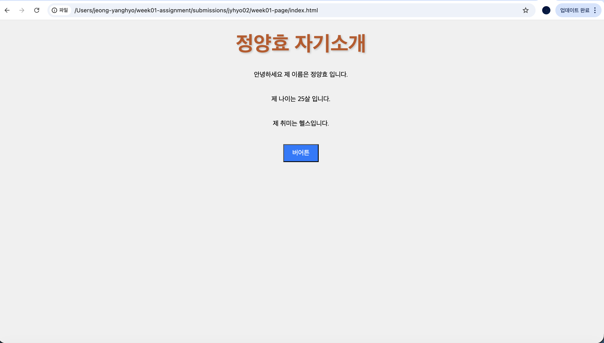
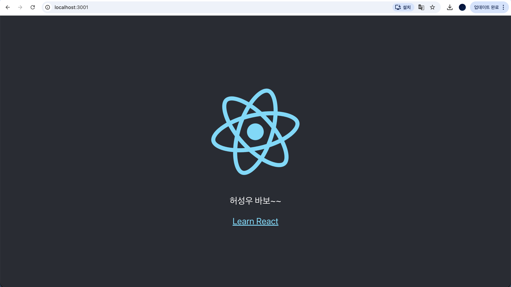
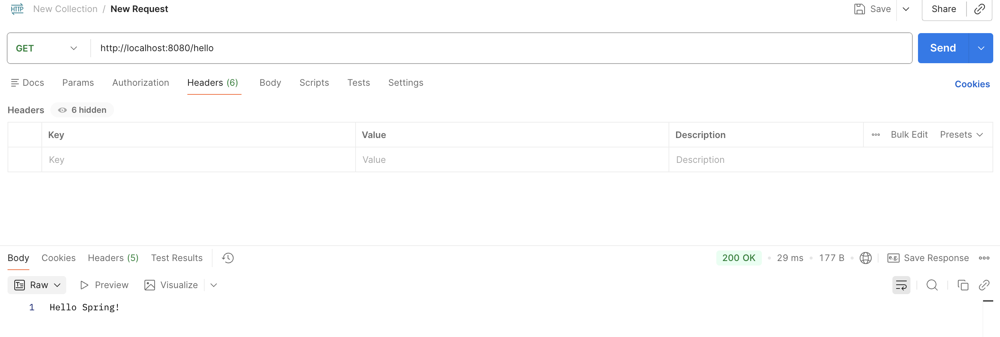

# 1주차 과제 제출 - 개발 환경 & 웹 기초

이 저장소는 **LikeLion 부트캠프 1주차 과제**를 수행한 결과를 포함하고 있습니다.

## 📋 과제 개요

| 실습 | 제목 | 상태 | 배점 |
|------|------|------|------|
| 1 | 개발 환경 버전 확인 | ✅ 완료 | 10점 |
| 2 | 간단한 웹 페이지 (HTML/CSS/JS) | ✅ 완료 | 40점 |
| 3 | Git & GitHub | ✅ 완료 | 25점 |
| 4 | React 프로젝트 (선택) | ✅ 완료 | 15점 |
| 5 | Spring Boot API (선택) | ✅ 완료 | 10점 |

---

## 📁 파일 구조

```
submissions/jyhyo02/
├── README.md                 # 이 파일 - 과제 설명 및 실행 가이드
├── practice1-env.md          # 실습 1: 개발 환경 버전 확인 결과
└── week01-page/              # 실습 2: 자기소개 정적 웹 페이지
    ├── index.html            # HTML 구조
    ├── style.css             # CSS 스타일
    ├── main.js               # JavaScript 로직
    └── images/               # 스크린샷 및 증빙 자료
        ├── html.png          # 실습 2: 자기소개 웹 페이지 실행 화면
        ├── react.png         # 실습 4: React 프로젝트 실행 화면
        └── SpringbootHello.png # 실습 5: Spring Boot API 응답 화면
```

---

## 🚀 과제 설명

### 실습 1 - 개발 환경 확인

**과제 내용:**
- Node.js 버전
- npm 버전
- Java 버전
- Git 버전
- Javac 버전

---

### 실습 2 - 자기소개 웹 페이지

**실행 방법:**
1. VS Code에서 `week01-page/index.html` 열기
2. 파일 우클릭 → **Open with Live Server**
3. 브라우저에서 http://localhost:5500 자동 오픈

**페이지 기능:**
- 자기소개 정보 표시 (이름, 나이, 취미)
- 버튼 클릭 시 alert 팝업
- 브라우저 Console(F12)에 현재 시간 출력

**배포 주소:** https://jyhyo02.github.io/likelion_week01/submissions/jyhyo02/week01-page/

**실행 화면:**



---

### 실습 3 - Git & GitHub

개인 GitHub 저장소에 과제 전체를 푸시했습니다.

**저장소 주소:** https://github.com/jyhyo02/likelion_week01.git

---

### 실습 4 - React 프로젝트

**변경 사항:**
- App.js에서 기본 문구를 "허성우바보"로 변경

**수정된 App.js:**

```javascript
import logo from './logo.svg';
import './App.css';

function App() {
  return (
    <div className="App">
      <header className="App-header">
        
        <p>허성우바보 </p>
        <a
          className="App-link"
          href="https://reactjs.org"
          target="_blank"
          rel="noopener noreferrer"
        >
          Learn React
        </a>
      </header>
    </div>
  );
}

export default App;
```

**실행 화면:**



---

### 실습 5 - Spring Boot Hello API

**응답:**
```
Hello Spring!
```

**HelloController.java:**

```java
package com.example.spring_hello;

import org.springframework.web.bind.annotation.GetMapping;
import org.springframework.web.bind.annotation.RestController;

@RestController
public class HelloController {

    @GetMapping("/hello")
    public String hello() {
        return "Hello Spring!";
    }
}
```

**API 응답 화면:**




